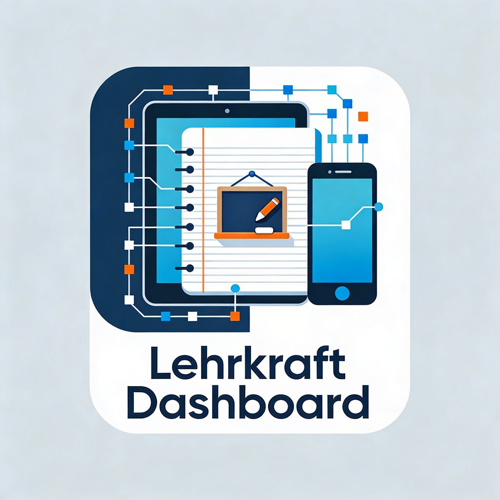

<div align="center">

[](https://www.buymeacoffee.com/highfish)



# 📚✨ trtKlassenbuch

### Buntes, modernes Klassenbuch für den Schulalltag 🏫

[](https://github.com/jbkunama1/trt.Klassenbuch)
[](https://github.com/jbkunama1/trt.Klassenbuch)
[](https://github.com/jbkunama1/trt.Klassenbuch)
[](https://github.com/jbkunama1/trt.Klassenbuch)

</div>

---

## 🌈 Was ist trtKlassenbuch?

`trtKlassenbuch` ist eine **webbasierte Lehrer:innen-App** für Planung, Dokumentation und Organisation im Unterricht – mit Fokus auf **einfache Nutzung**, **buntes Design** und **schnellen Workflow**.

---

## ✨ Features

- 🔐 **Login-Bereich** mit Passwortabfrage
- 📖 **Klassenbuch** mit Wochenansicht und Unterrichtseinträgen
- 👥 **Klassenlisten** mit Schülerverwaltung
- 🗓️ **Wochenreflexionen** direkt im Dashboard
- 📋 **Curriculum-/UVP-Bereich** zur Unterrichtsplanung
- 📦 **Backup-Export** als JSON-Datei
- 🖨️ **Exportfunktionen** (z. B. für Klassenbuch/Klassenlisten)
- 🌙 **Dark Mode** + farbenfrohes UI

---

## 🖼️ Projekt-Highlights

- 🎨 moderne, farbige Oberfläche
- 🧩 klare Modulstruktur im UI
- 📱 responsive Darstellung für verschiedene Bildschirmgrößen
- ⚡ keine Build-Pipeline nötig – direkt startklar

---

## 🗂️ Projektstruktur

```text
trtKlassenbuch/
├── index.html       # Hauptanwendung (inkl. eingebetteter Logik/Styles)
├── app.js           # JS-Logik (separate Variante)
├── style.css        # Styles (separate Variante)
├── logo.png         # Projektlogo
├── bewertungsbogen/ # Zusatzordner
└── README.md
```

---

## ▶️ Schnellstart

1. Repository klonen
2. `index.html` im Browser öffnen
3. Einloggen und loslegen ✅

> 💡 Tipp: Für die lokale Entwicklung reicht ein einfacher statischer Webserver (optional).

---

## 🧪 Tech Stack

- 🧱 **HTML5**
- 🎨 **CSS3**
- ⚙️ **Vanilla JavaScript (ES6)**

---

## 📄 Lizenz

Dieses Projekt steht unter der **MIT License**. Siehe [`LICENSE`](./LICENSE).

